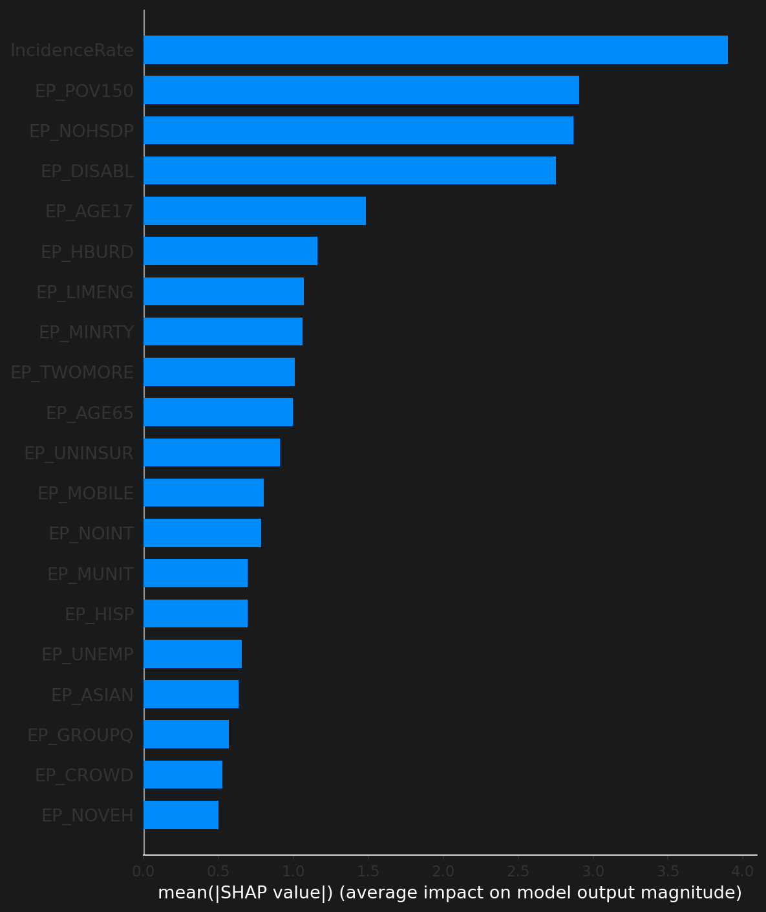
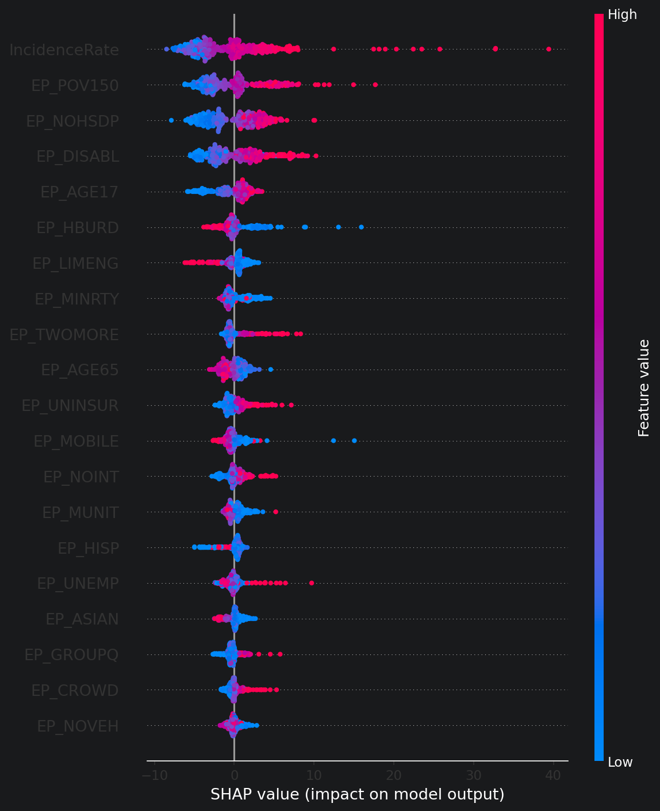
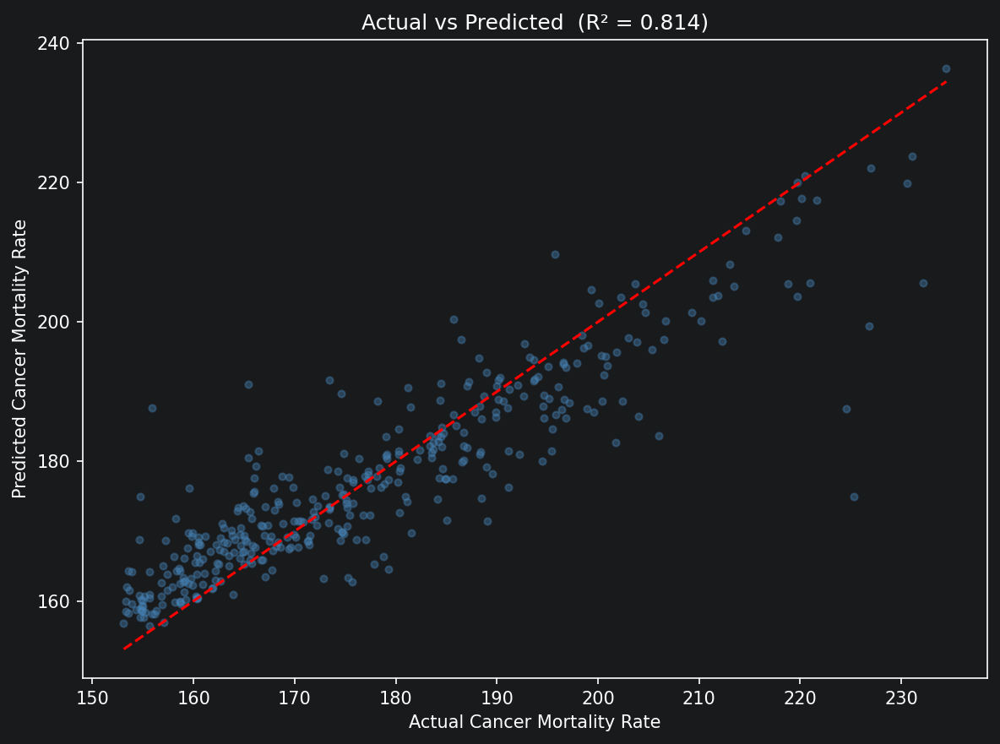

# Cancer Mortality Prediction Across US Counties

Cancer death rates vary dramatically across US counties, sometimes by a factor of two between neighboring regions. This project investigates how much of that variation can be explained by socioeconomic factors, using XGBoost and SHAP analysis on county-level data from the CDC and NCI.

---

## Data Sources

| Dataset | Source | Coverage |
|---|---|---|
| Cancer mortality by county (2019-2023) | [CDC Wonder](https://wonder.cdc.gov/) | ~2,000 counties |
| Social Vulnerability Index (2022) | [CDC ATSDR SVI](https://www.atsdr.cdc.gov/placeandhealth/svi/) | 3,144 counties |
| Cancer incidence by county | [NCI SEER](https://seer.cancer.gov/) | ~3,100 counties |

Datasets were joined on 5-digit FIPS county codes. Counties with suppressed mortality counts were excluded.

---

## Project Structure

```text
us-county-cancer-mortality-ml/
├── data/                               # raw + processed CSVs (not tracked)
├── notebooks/
│   ├── 01_eda_and_preprocessing.ipynb
│   ├── 02_model_training_and_eval.ipynb
│   ├── 03_shap_explainability.ipynb
│   └── 04_geospatial_visualization.ipynb
├── visualizations/
│   ├── shap_feature_importance.png
│   ├── shap_beeswarm.png
│   ├── actual_vs_predicted.png
│   ├── eda_distributions.png
│   └── cancer_mortality_map.html
└── README.md
```

---

## Methodology

**Preprocessing:** SVI missing values (`-999`) replaced with column medians. FIPS codes zero-padded to 5 digits for consistent joining across all three datasets.

**Data leakage check:** Before training, all features were verified to contain no direct derivatives of the mortality rate target. Incidence rate was included intentionally as a clinically distinct predictor, diagnosis rate rather than death rate.

**Models:** A Linear Regression baseline and an XGBoost regressor, both evaluated with 5-fold cross-validation.

**Explainability:** SHAP TreeExplainer applied to the final XGBoost model to produce global feature rankings and directional analysis.

---

## Model Performance

| Model | R² (5-Fold CV) | RMSE | MAE |
|---|---|---|---|
| Linear Regression (baseline) | 0.374 | 16.60 | 12.38 |
| XGBoost | 0.404 | 16.26 | 11.92 |

XGBoost improves R² by about 8 percent over the linear baseline. The overall R² is still modest because several important variables are missing from the dataset, including county-level smoking rates, obesity prevalence, and healthcare facility density.

---

## Key Findings

The four strongest predictors of cancer mortality are listed below.

| Feature | SHAP Impact | Direction |
|---|---|---|
| Incidence Rate | 3.90 | Higher incidence, higher mortality |
| EP_POV150 (Poverty rate) | 2.91 | Higher poverty, higher mortality |
| EP_NOHSDP (No high school diploma) | 2.87 | Higher, higher mortality |
| EP_DISABL (Disability rate) | 2.75 | Higher, higher mortality |

One unexpected result is that `EP_HBURD` (housing cost burden), `EP_LIMENG` (limited English), and `EP_MINRTY` (minority percentage) show negative SHAP direction. In this model, higher values in those variables were associated with lower predicted mortality. This may reflect the Hispanic health paradox or urban density effects, and it deserves closer follow-up.

---

## Visualizations

### Feature Importance (SHAP)


### Direction and Magnitude of Each Feature


### Actual vs Predicted Mortality Rate


The interactive county-level map is available at `visualizations/cancer_mortality_map.html`. Open it in a browser.

---

## Health Equity Interpretation

Two counties with similar cancer incidence rates can still have very different mortality outcomes because of differences in socioeconomic conditions. Poverty, lower education, and disability appear as strong predictors, which suggests the gap is shaped by structural disadvantage rather than individual behavior alone.

This pattern is consistent with delayed diagnosis and weaker access to treatment in underserved counties. The findings support targeted screening, earlier intervention, and better insurance access in high-poverty areas.

---

## Limitations

- R² = 0.40 leaves substantial unexplained variance. Important missing variables include smoking rates, obesity prevalence, healthcare facility density, and stage-at-diagnosis data.
- Suppressed counties, usually small rural populations, were excluded. That may bias the results toward more populated areas.
- SVI data are from 2022, while mortality data cover 2019-2023, so there is a small temporal mismatch.
- This is a predictive model, not a causal one. SHAP values show association, not causation.

---

## Setup

```bash
git clone https://github.com/johnbozorgi/us-county-cancer-mortality-ml.git
cd us-county-cancer-mortality-ml
python -m venv .venv
source .venv/bin/activate
pip install -r requirements.txt
```

Run notebooks in order, from 01 to 04. Data files should be downloaded separately from the links in the Data Sources table and placed in `data/`.

---

## Dependencies

`xgboost`, `shap`, `scikit-learn`, `pandas`, `numpy`, `matplotlib`, `seaborn`, `plotly`

---

## Author

**Hamid Janbozorgi**

MS Computer Science — University of Illinois Urbana-Champaign (UIUC)

[hamidj2@illinois.edu](mailto:hamidj2@illinois.edu) · [github.com/johnbozorgi](https://github.com/johnbozorgi)
